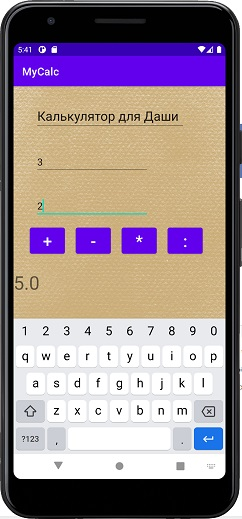
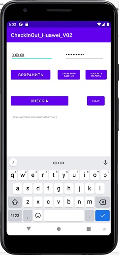
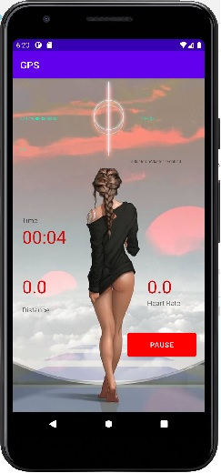

# Rostislav Telitsin
Hi,  

My name is **Rostislav Telitsin**  
I'm from Russia  
I'm 42  
I like coding. I'm working in the telecommunication industry and want to change occupation  

my email - *rostislav.telitsin@gmail.com*  

___

## My portfolio 
The main aim of this portfolio is just to demonstrate my coding skills  
I hope it can help me to get a job of the software developer  

___

###  [Python portfolio](Python_Poftfolio.github.io) 

I have some python experience. You can see it [here](Python_Poftfolio.github.io)  
Python is used to make a more simple routing work of my current job as far as in possible  
___

###  Java portfolio

___

- #### [BabyCalc](https://github.com/RostislavTelitsin/babyCalc)

Simple calculator  
it implements the procedures of addition, subtraction, multiplication and division

___
- #### [CheckIn/CheckOut Tool](https://github.com/RostislavTelitsin/CheckInOut.git)

This is android/java tool to implement CheckIn and CheckOut on site of my employer (when you start and finish your working day)

___

- #### [Running tracker](https://github.com/RostislavTelitsin/runner.git)

Tracker for running shows distance, time and heartbeat rate  

